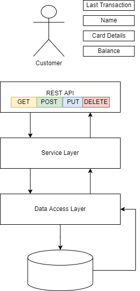

# SpringBoot-Sample
A simple sample using Spring Boot and Spring Data JPA service with REST API. To learn certain services provided by Spring framework.

## Table of contents
* [General Info](#general-info)
* [Technologies](#technologies)
* [Setup](#setup)

## General Info
#### The flowchart on how the program is working:

## Technologies
* Java 11
* Maven Project
* Spring Boot 2.6.4
* PostgresSQL

## Setup
To run this project, install it locally using git clone
